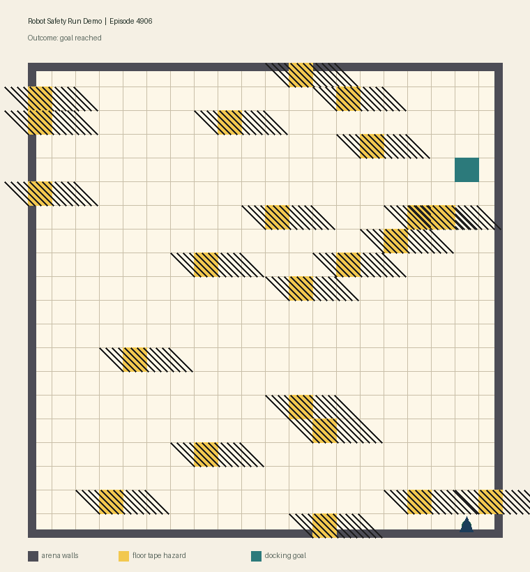

# RL Robot Navigation + Live Dashboard

A full reinforcement learning project where a PPO agent learns 2D robot navigation and streams live training telemetry to a web dashboard.

## Demo GIF



Generated from live telemetry with:

```bash
cd sim
source venv/bin/activate
python generate_demo_gif.py --output ../dashboard/public/demo_robot_safety_run.gif
```

## Quick start (3 terminals)

```bash
# Terminal 1
cd server && npm install && npm start

# Terminal 2
cd dashboard && npm install && npm start

# Terminal 3
cd sim
python3 -m venv venv
source venv/bin/activate
pip install -r requirements.txt
python train.py --timesteps 100000
```

## Frontend navigation

- `http://localhost:3100/` -> Home / Control Center
- `http://localhost:3100/monitor.html` -> Live training dashboard
- Home page includes the main entry link to the monitor page and quick-start commands

## What is built

- Custom Gymnasium navigation environment (`sim/env/robot_nav_env.py`)
- PPO training pipeline via Stable-Baselines3 (`sim/train.py`)
- Episode-level telemetry emitter (`sim/utils/training_callback.py`)
- Real-time metrics backend with Socket.IO (`server/index.js`)
- Live dashboard with charts + trajectory viewer (`dashboard/public/*`)
- Frontend navigation with landing page + dedicated monitor route
- Evaluation and rollout scripts (`sim/evaluate.py`, `sim/play.py`)

## Project layout

```text
RL/
├── sim/
│   ├── train.py
│   ├── evaluate.py
│   ├── play.py
│   ├── generate_demo_gif.py
│   ├── requirements.txt
│   ├── env/robot_nav_env.py
│   ├── agents/ppo_agent.py
│   └── utils/
│       ├── metrics_emitter.py
│       └── training_callback.py
├── server/
│   ├── package.json
│   └── index.js
└── dashboard/
    ├── package.json
    ├── server.js
    └── public/
        ├── index.html
        ├── monitor.html
        ├── styles.css
        └── app.js
```

## Run locally

### 1) Start metrics backend (default: `http://localhost:4100`)

```bash
cd server
npm install
npm start
```

### 2) Start dashboard (default: `http://localhost:3100`)

```bash
cd dashboard
npm install
npm start
```

Frontend routes:
- `http://localhost:3100/` -> landing page (easy navigation)
- `http://localhost:3100/monitor.html` -> live metrics dashboard

### 3) Train PPO and stream live metrics

```bash
cd sim
python3 -m venv venv
source venv/bin/activate
pip install -r requirements.txt
python train.py --timesteps 100000
```

### 4) Evaluate trained model

```bash
python evaluate.py --model-path models/ppo_robot_nav.zip --episodes 100
```

### 5) Run one rollout in terminal

```bash
python play.py --model-path models/ppo_robot_nav.zip
```

## Live metrics sent to dashboard

- `reward`
- `avg_reward_100`
- `success_rate`
- `collision_rate`
- `steps`
- `trajectory`, `goal`, `obstacles`, `grid_size`

## Notes

- Ports are configurable via env vars:
  - backend: `PORT` (default `4100`)
  - dashboard: `PORT` (default `3100`)
- Training emits metrics via HTTP to backend endpoint `/metrics`, then backend broadcasts over WebSockets.

## Future Goals (Arduino Deployment After >90% Success)

- Validate policy robustness in sim first: test across randomized starts, obstacles, and sensor noise (target: maintain >90% success, low wall/tape collisions).
- Convert policy to embedded-friendly controller: distill PPO policy into a smaller MLP or rule-assisted policy suitable for microcontrollers.
- Export model weights for firmware inference: generate fixed-point/int8 weights and run forward pass in C/C++ on-device.
- Select hardware that can handle inference reliably: prefer ESP32/Teensy-class boards (typical Arduino Uno RAM/flash is often too limited for NN inference).
- Map sim observations to real sensors: fuse wheel odometry + IMU + distance sensors to match `(x, y, goal, distance)`-style inputs.
- Implement motor control bridge: translate policy action output to motor driver commands (`up/down/left/right` equivalent differential drive motions).
- Add hard safety layer in firmware: emergency stop, wall/tape override, timeout recovery, and manual kill-switch independent of RL output.
- Run sim-to-real calibration loop: tune reward/model based on real-world drift, wheel slip, and sensor latency.
- Deploy telemetry back to dashboard: stream live robot metrics (success rate, collisions, path trace) from Arduino/edge bridge to current backend.
